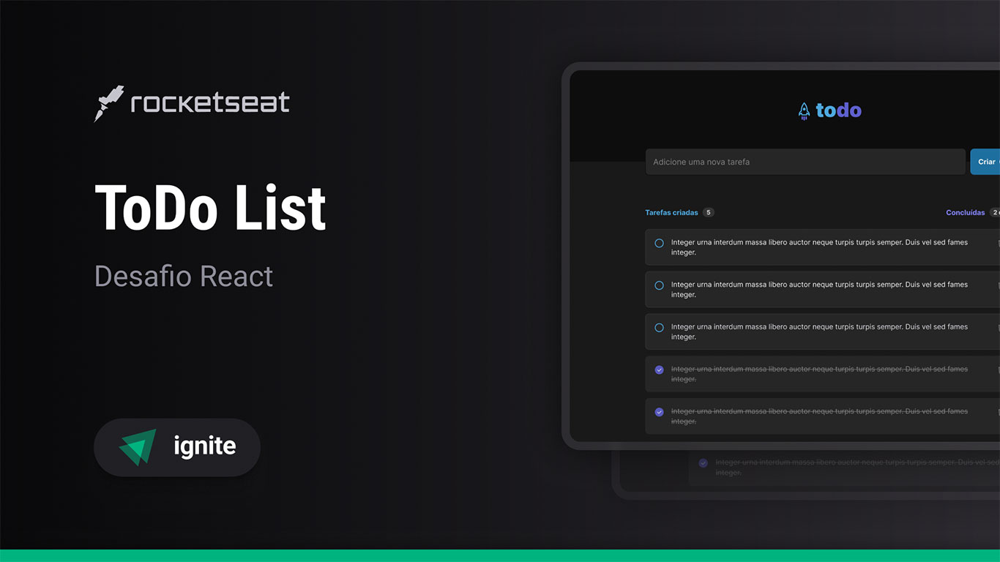

# Ignite ToDo

<p align="center">
    
</p>

## Sobre o Projeto

O Ignite ToDo é uma aplicação de gerenciamento de tarefas desenvolvida como parte do programa Ignite da Rocketseat. O objetivo principal é permitir que os usuários criem, acompanhem e concluam tarefas de forma simples e eficiente.

## Funcionalidades

- Adicionar novas tarefas.
- Marcar tarefas como concluídas.
- Excluir tarefas.
- Contagem de tarefas criadas e concluídas.

## Tecnologias Utilizadas

- **React:** Biblioteca JavaScript para construção de interfaces de usuário.
- **TypeScript:** Superset do JavaScript que adiciona tipagem estática.
- **CSS Modules:** Para estilização isolada e modular.
- **Vite:** Ferramenta de build rápida para desenvolvimento web.

## Como Executar o Projeto

1.  Clone o repositório:

    ```bash
    git clone [https://github.com/Robson16/ignite-todo.git](https://github.com/Robson16/ignite-todo.git)
    ```

2.  Acesse o diretório do projeto:

    ```bash
    cd ignite-todo
    ```

3.  Instale as dependências:

    ```bash
    npm install
    ```

4.  Inicie o servidor de desenvolvimento:

    ```bash
    npm run dev
    ```

## Demonstração Online

[Acessar Demonstração](https://ignite-todo-pi.vercel.app/)

## Layout no Figma

[Acessar Layout no Figma](https://www.figma.com/file/0n0zDN7zbzhRbaEO74Xesx/ToDo-List)

## Contribuição

Contribuições são bem-vindas! Sinta-se à vontade para abrir issues e enviar pull requests.

## Licença

Este projeto está sob a licença MIT. Consulte o arquivo [LICENSE](./LICENSE) para mais informações.

### ☕❤

[Robson H. Rodrigues](https://www.linkedin.com/in/robson-h-rodrigues-93341746/)
